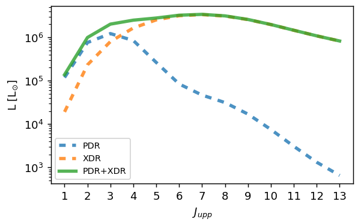
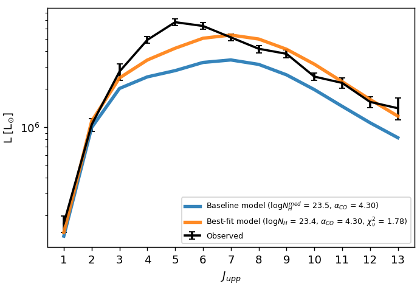

# galaxySLED: a code to reproduce and fit a galaxy CO SLED
A new physically-motivated model for estimating the molecular line emission in active galaxies.
The underlying model is described in [Esposito et al. 2024](https://ui.adsabs.harvard.edu/abs/2024MNRAS.527.8727E/abstract), and it has been tested with the galaxies data presented in [Esposito et al. 2022](https://ui.adsabs.harvard.edu/abs/2022MNRAS.512..686E/abstract).

The model takes into account:
- the internal density structure of giant molecular clouds (GMCs)
- the heating associated both to stars and to the active galactic nuclei (AGN), respectively producing photodissociation regions (PDRs) and X-ray dominated regions (XDRs) within the GMCs
- the mass distribution of GMCs within the galaxy volume

#### What you have to input to produce a CO SLED
To produce a synthetic CO SLED you need to feed the code with:
- The molecular gas mass of your object
- The optical radius
- The intrinsic nuclear X-ray luminosity
- The three Sersic parameters (Ie, Re, n) for the FUV flux

With these input data, the code will produce the expected CO SLED of your object: this is called the "Baseline model".
This can be useful for your telescope proposals, or you can play with it by changing one of the input to see their impact on the CO distribution and emission.

#### Fitting an observed CO SLED to derive alphaCO and NH
If you already have the luminosity of some CO lines, you can make the baseline model fit the observed data.
Input the CO luminosities with their errors, it works with upper limits as well.
The output will be:
- The best-fit CO SLED, up to CO(30-29)
- The best-fit CO-to-H2 conversion factor alphaCO
- The best-fit X-ray attenuation column density NH

## Download the code and set up the environment
You can download the zipped directory [here](https://github.com/federicoesposito/galaxySLED/archive/refs/heads/main.zip) or from [github](https://github.com/federicoesposito/galaxySLED).

I suggest you to create a new environment on your machine.
You can find a `galaxysled_env.yml` file in the main directory, 
which contains all the packages and versions you need to install.
If you have `conda`, you can just type in a terminal `conda env create -f galaxysled_env.yml`:
this will create an environment called `galaxysled` containing all the necessary packages.
Once created, activate it with the command `conda activate galaxysled`.

## Run the python notebook `galaxySLED_notebook.ipynb` to learn how to use the code
The notebook contains a walkthrough and a real-galaxy example for calculating the CO SLED (with plots)

* * *

## What are the contents of the code directories
The `data` directory contains the PDR and XDR emission for different Giant Molecular Clouds (GMCs). At the moment there is only one model of 15 GMCs (which is the one described in Esposito et al., subm.). There is one file, `GMC_e23.csv`, which contains the description of each GMC (as their masses, radii, etc). The other files, 2 for each GMC, contain the PDR and XDR estimated emission: every column is a CO line, where `CO4` means the CO(4-3) line, and every row is a different incident flux.

The `modules` directory contains the Python modules with the functions that run the different parts of the code. The `gmcs.py` module contains the definition of the GMC class and the list of the available built-in GMCs. The `functions.py` module contains all the useful functions.

The `ngc7469` directory contains a single file, which can be reproduced by the notebook. Every row is a different galactocentric radius, and the columns are the radial profiles of mass, volume, number of GMCs, column density, etc.

* * *

# Acknowledgements

The galaxySLED logo uses the following icon: 
<a href="https://www.flaticon.com/free-icons/black-hole" title="black hole icons">Black hole icons created by Freepik - Flaticon</a>
