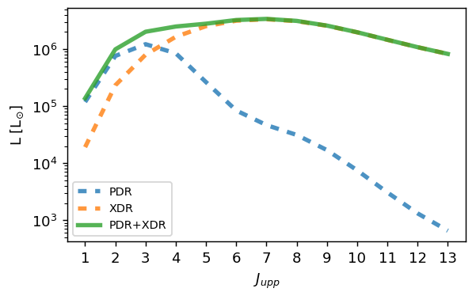
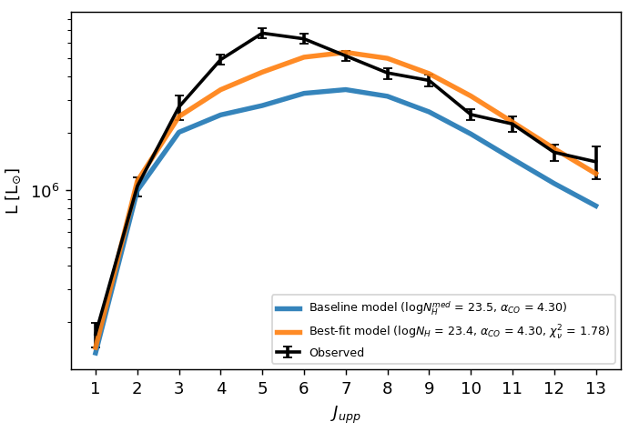
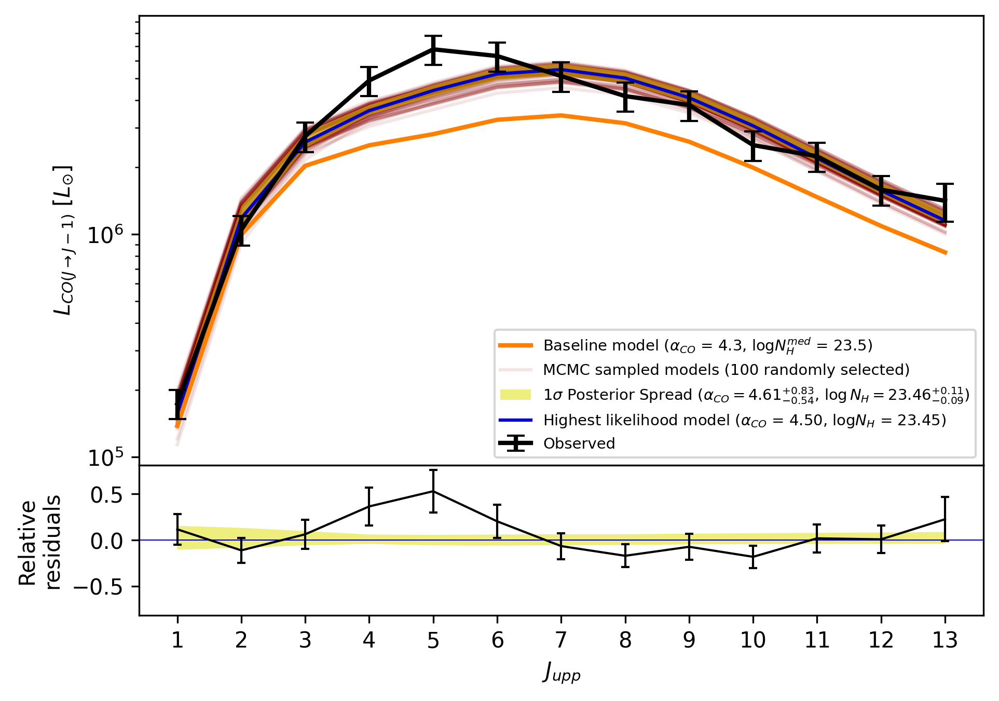
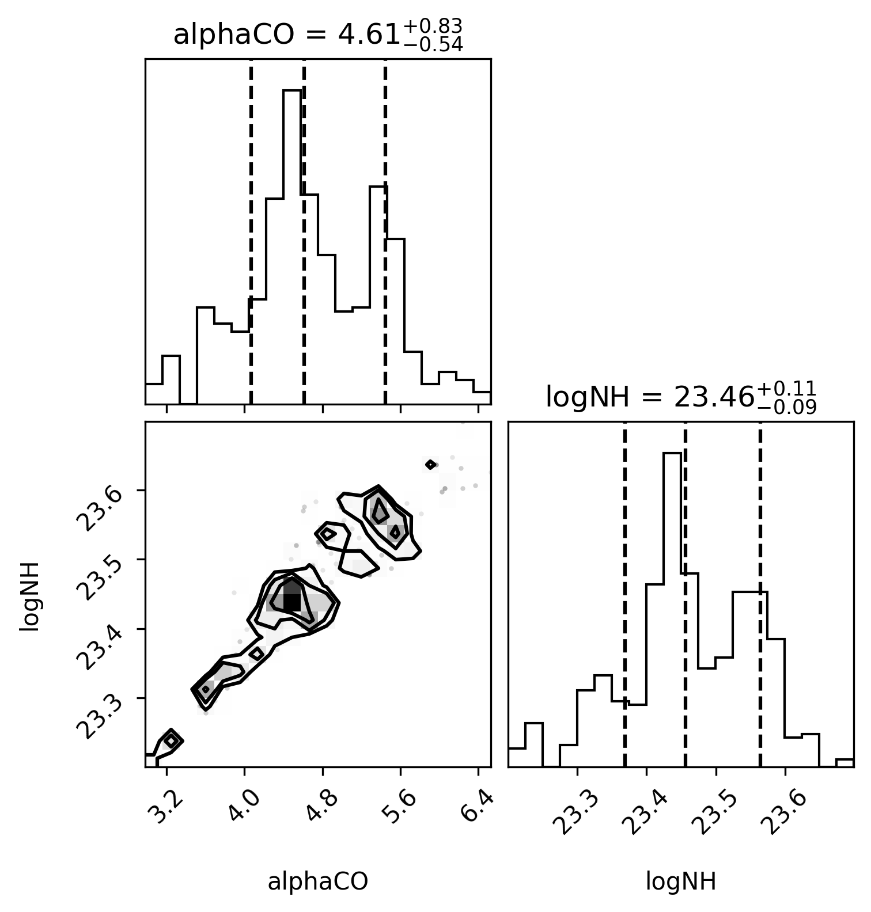

# galaxySLED: a code to reproduce and fit a galaxy CO SLED
A new physically-motivated model for estimating the molecular line emission in active galaxies.
The underlying model is described in [Esposito et al. 2024](https://ui.adsabs.harvard.edu/abs/2024MNRAS.527.8727E/abstract), and it has been tested with the galaxies data presented in [Esposito et al. 2022](https://ui.adsabs.harvard.edu/abs/2022MNRAS.512..686E/abstract).

The model takes into account:
- the internal density structure of giant molecular clouds (GMCs)
- the heating associated both to stars and to the active galactic nuclei (AGN), respectively producing photodissociation regions (PDRs) and X-ray dominated regions (XDRs) within the GMCs
- the mass distribution of GMCs within the galaxy volume

#### What you have to input to produce a CO SLED
To produce a synthetic CO SLED you need to feed the code with:
- The molecular gas mass of your object
- The optical radius
- The intrinsic nuclear X-ray luminosity
- The star formation rate (SFR), or even better the three Sersic parameters (Ie, Re, n) for the FUV flux

With these input data, the code will produce the expected CO SLED of your object: this is called the "Baseline model".
This can be useful for your telescope proposals, or you can play with it by changing one of the input to see their impact on the CO distribution and emission.

#### Fitting an observed CO SLED to derive alphaCO and NH
If you already have the luminosity of some CO lines, you can make the baseline model fit the observed data.
Input the CO luminosities with their errors, it works with upper limits as well.
The output will be:
- The best-fit CO SLED, up to CO(30-29)
- The best-fit CO-to-H2 conversion factor alphaCO
- The best-fit X-ray attenuation column density NH

#### Fitting an observed CO SLED with a MCMC algorithm
A more sophisticated approach to fit the observed CO SLED is to use a Bayesian Markov chain monte Carlo (MCMC) method with a chi-square likelihood function. This will determine the posterior probability distribution of the model parameters, i.e. the CO-to-H2 conversion factor alphaCO and the X-ray attenuation column density NH.

## Download the code and set up the environment
You can directly install galaxySLED from the Python Package Index with the command `pip install galaxysled`.
You can also download the zipped directory [here](https://github.com/federicoesposito/galaxySLED/archive/refs/heads/main.zip) or from [github](https://github.com/federicoesposito/galaxySLED), or the zipped [package](https://github.com/federicoesposito/galaxySLED/blob/main/dist/galaxysled-0.1.5.tar.gz).

I suggest you to create a new environment on your machine.
You can do so by typing the command `python3 -m venv galaxysled_env`, where you can substitute `galaxysled_env` with the name you want. This command will create a directory named as your new environment. To activate it from the current directory, type the command `source galaxysled_env/bin/activate`. This will change your shell's prompt to show what virtual environment you're using. 
If you use Python within a conda environment, you should create the environment by typing `conda create --name galaxysled_env`, and activate it with `conda activate galaxysled_env`.
As first thing, within the new environment, type `pip install --upgrade pip` to make sure you are using the last available version of the package installer `pip`.

From within the new environment, type the command `pip install galaxysled`.
This will install galaxySLED with all the required dependencies (i.e. other packages).
These will be available only within the environment (so they don't mess up your local Python packages versions).
Now you can open a python terminal, and import galaxysled as you would do with any python library, e.g. `import galaxysled as gs`.

To exit from the environment, just type `deactivate` (or `conda deactivate`).

## Run the python notebook `galaxySLED_notebook.ipynb` to learn how to use the code
The notebook contains a walkthrough and a real-galaxy example for calculating the CO SLED (with plots).
You can download the notebook from the [galaxySLED GitHub](https://github.com/federicoesposito/galaxySLED): it is a `.ipynb` file in the `docs` directory.

If you created a virtual environment, you should install the IPython kernel in your virtual environment to use it with Jupyter: to do so just type the command
`python -m ipykernel install --user --name=galaxysled_env` from within the environment,
where `galaxysled_env` is the name of the environment.
Now type `jupyter notebook` in the terminal to open Jupyter, and open the `.ipynb` file. Once opened, make sure to select the `galaxysled_env` kernel from the drop-down menu on the top-right of the window, or in the `Kernel > Change kernel` menu.

* * *

## What are the contents of the code directories
The `src/galaxysled/resources` directory contains the PDR and XDR emission for different Giant Molecular Clouds (GMCs). At the moment there is only one model of 15 GMCs (which is the one described in Esposito et al., 2024). There is one file, `GMC_e24.csv`, which contains the description of each GMC (as their masses, radii, etc). The other files, 2 for each GMC, contain the PDR and XDR estimated emission: every column is a CO line, where `CO4` means the CO(4-3) line, and every row is a different incident flux.

The `src/galaxysled` directory contains the Python modules with the functions that run the different parts of the code. The `gmcs.py` module contains the definition of the GMC class and the list of the available built-in GMCs. The `functions.py` module contains all the useful functions. The `functions_mcmc.py` contains some functions for a Markov chain Monte Carlo (MCMC) analysis. The `__init__.py` file is used to initialize the galaxySLED package by importing the module packages.

The `tests/test_gmc_fill.py` contains the first blocks of the Jupyter notebook. It is intended to test the `gmc_fill` function in a quick way (not for science use).

The `docs/ngc7469` directory contains a single `.csv` file, which can be reproduced by the notebook. Every row is a different galactocentric radius, and the columns are the radial profiles of mass, volume, number of GMCs, column density, etc.

* * *

# Acknowledgements

Thanks to Xavier López López, Dr. Francesco Salvestrini, and Dr. Giovanna Speranza for patiently testing the code.

Thanks to all the co-authors of the [Esposito et al. 2024](https://ui.adsabs.harvard.edu/abs/2024MNRAS.527.8727E/abstract) paper for helping me building the model. You can find more acknowledgements at the end of the paper.

The galaxySLED logo uses the following icon: 
<a href="https://www.flaticon.com/free-icons/black-hole" title="black hole icons">Black hole icons created by Freepik - Flaticon</a>
